# 《不用 Claude 免費也能跑！Wazuh MCP 保母級教學｜100% 成功安裝 × 完整實戰》

> 智慧資安 412580084 蔡宇倫
>
> Thu, Jan 8, 2026 1:39 PM
>
> ⚠️ 請先**確保 Wazuh 有安裝**在 **VM** 上面
>
> 專案位置：https://github.com/alantsai1024/ThreatHuntingFinalProject?tab=readme-ov-file


## 🔊 前言

本方案提供給**希望在 VM 環境中安裝 Wazuh**，且**不使用 Docker** 的使用者。教學採用 **原生安裝方式**，從系統準備到服務啟動，完整帶你完成 Wazuh 與 MCP 的建置流程。

本教學**完全免費、不依賴 Claude**，以「照做即可成功」為原則，適合企業內網、實驗室或對容器化有顧慮的實務環境，快速打造可實際運作的 Wazuh MCP 架構。

## 🛠️ 環境安裝

### 1. Wazuh Manager 環境配置

#### 先確保 **Wazuh** 有在運作

```bash
sudo systemctl status wazuh-manager wazuh-indexer wazuh-dashboard
```

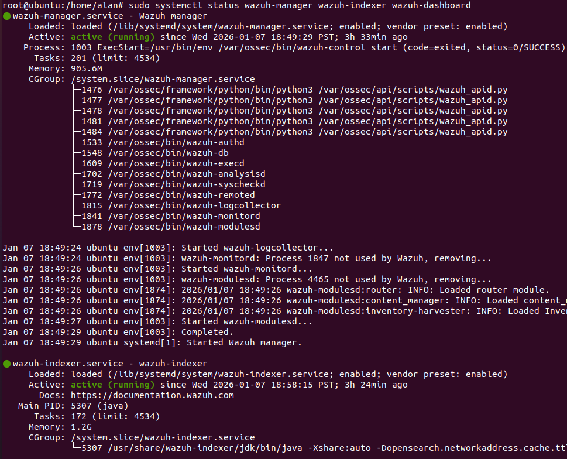

> ⚠️ 若沒運作請輸入：**sudo systemctl start wazuh-manager wazuh-indexer wazuh-dashboard**

#### 讓 Wazuh Manager Host 要對外可以開放

- **⚠️這是第一個坑要小心，沒開放很容易會出現9200 port 連不到**

**(1) 修改配置**

```bash
sudo nano /etc/wazuh-dashboard/opensearch_dashboards.yml
```

**(2) 修改為server.host: "0.0.0.0"**

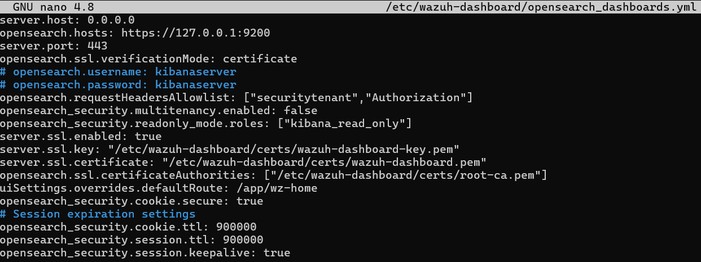

**(3) 重啟配置**

```bash
sudo systemctl restart wazuh-dashboard
```

### 2. Strawberry Perl 下載並安裝

- **⚠️這是第二個坑要小心，沒安裝我們在build rust專案會出現 perl not found 問題**
- **官網下載：**[點擊這裡前往](https://strawberryperl.com/)

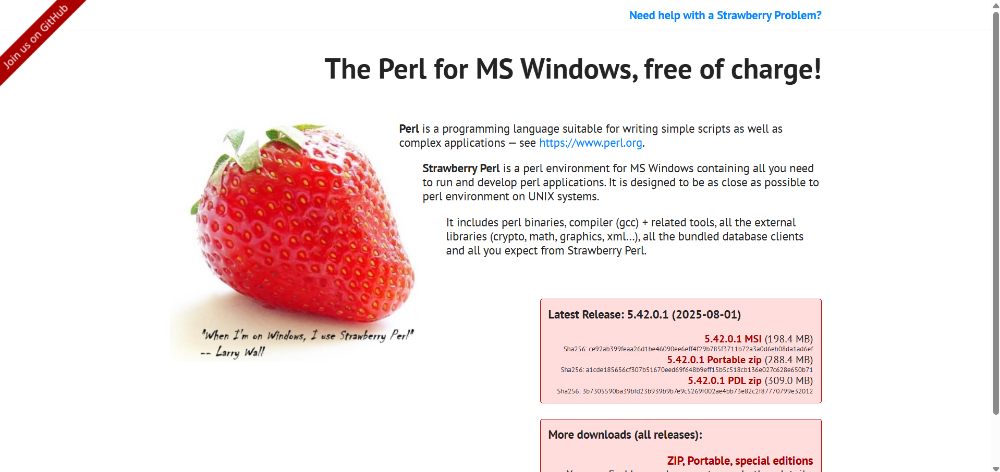

### 3. Visual Studio Community 下載並安裝

- **⚠️這是第三個坑要小心，沒安裝我們在build rust專案會出現 link.exe not found 問題**
- **官網下載：**[點擊這裡前往](https://visualstudio.microsoft.com/zh-hant/vs/community/)
  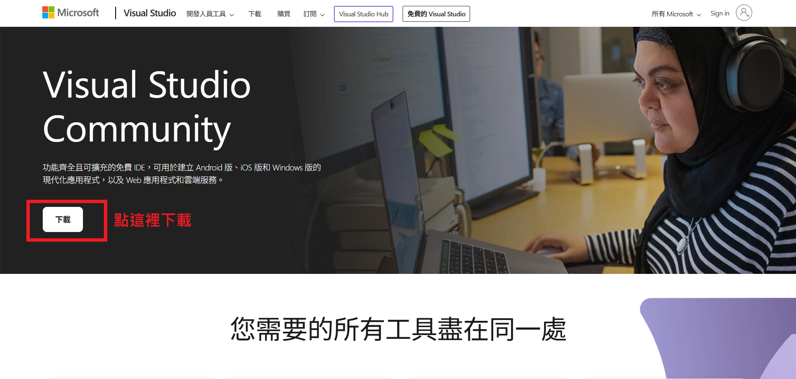
- **Visual Studio Community** 下載完後，要額外安裝 **Desktop development with C++ / MSVC toolchain**

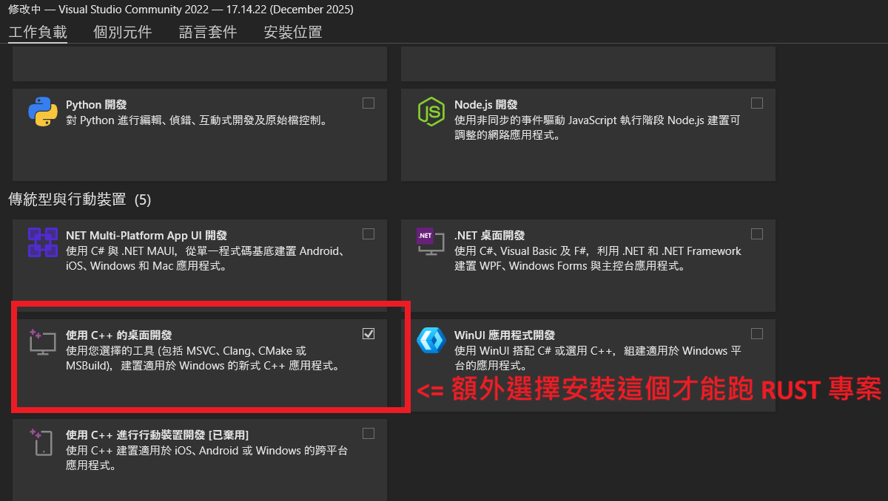

---

## 🔐 Wazuh 帳密與IP獲取

- 可將以下獲取完的資訊暫時先放入記事本中

### Wazuh API 獲取

```bash
tar -axf wazuh-install-files.tar wazuh-install-files/wazuh-passwords.txt -O | grep -P "\'wazuh\'" -A 1
```

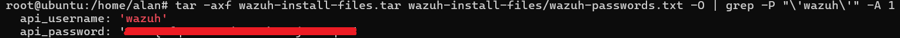

### Wazuh INDEXER 獲取

```bash
tar -axf wazuh-install-files.tar wazuh-install-files/wazuh-passwords.txt -O | grep -P "\'wazuh\'" -A 1
```

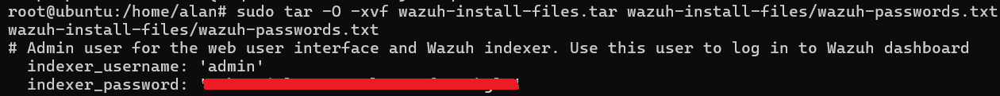

### API_HOST 與 INDEXER_HOST 獲取

```
hostname -I
```

---

## 👷‍♂️ MCP Server 建置

### 1. 開啟 VScode 並將專案克隆下來 (使用我的專案連結)

```
https://github.com/alantsai1024/ThreatHuntingFinalProject
```

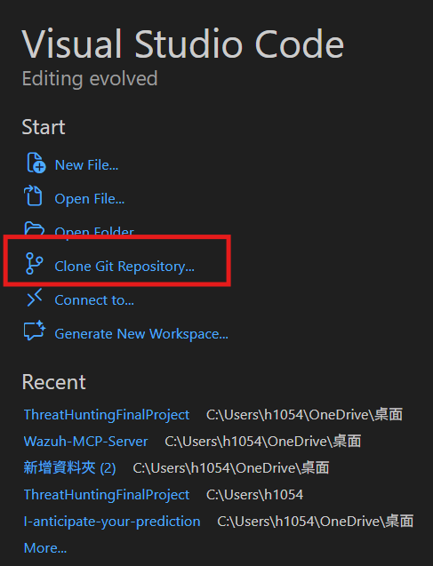

### 2. 點擊克隆，並選擇放置路徑並開啟專案 (我選在 C:/ 目錄下)

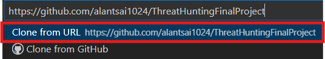

### 3. 建立 .env 在專案根目錄下並輸入以下 Wazuh 配置 ()

```bash
WAZUH_API_HOST= <你的IP>
WAZUH_API_PORT=55000
WAZUH_API_USERNAME=wazuh
WAZUH_API_PASSWORD=<你的API密碼>
WAZUH_INDEXER_HOST= <你的IP>
WAZUH_INDEXER_PORT=9200
WAZUH_INDEXER_USERNAME=admin
WAZUH_INDEXER_PASSWORD=<你的Indexer密碼>
WAZUH_VERIFY_SSL=false
RUST_LOG=info
```

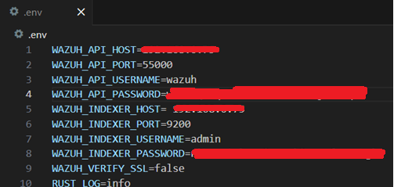

### 4. 使用 Native Tools 終端機

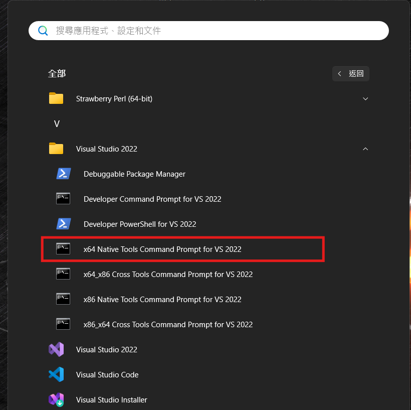

### 5. 前往克隆的專案路徑 (每個人不一樣)

```bash
cd C:\ThreatHuntingFinalProject
```

### 6. 建立 RUST 專案依賴項環境

```bash
cargo build
```

### 7. 運行 RUST 專案 (也就是MCP Server)

```bash
cargo run
```

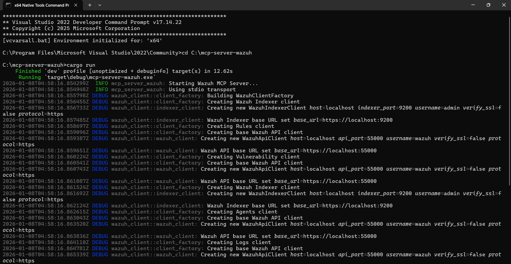

## 👷🏻‍♀️ MCP HOST 建置

### 1. 正版免費 AI API Key 獲取

- **OpenRouter**：[點擊前往獲取](https://openrouter.ai/)
- **Step 1 點擊 Get API Key**
  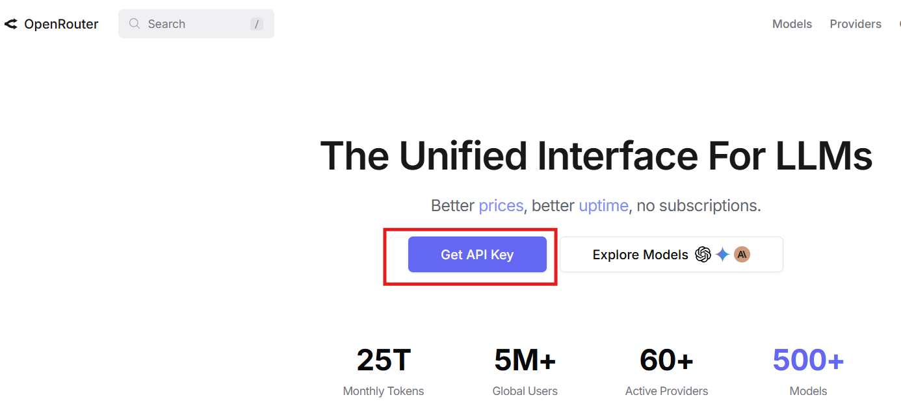
- **Step 2 點擊 Create API Key**
  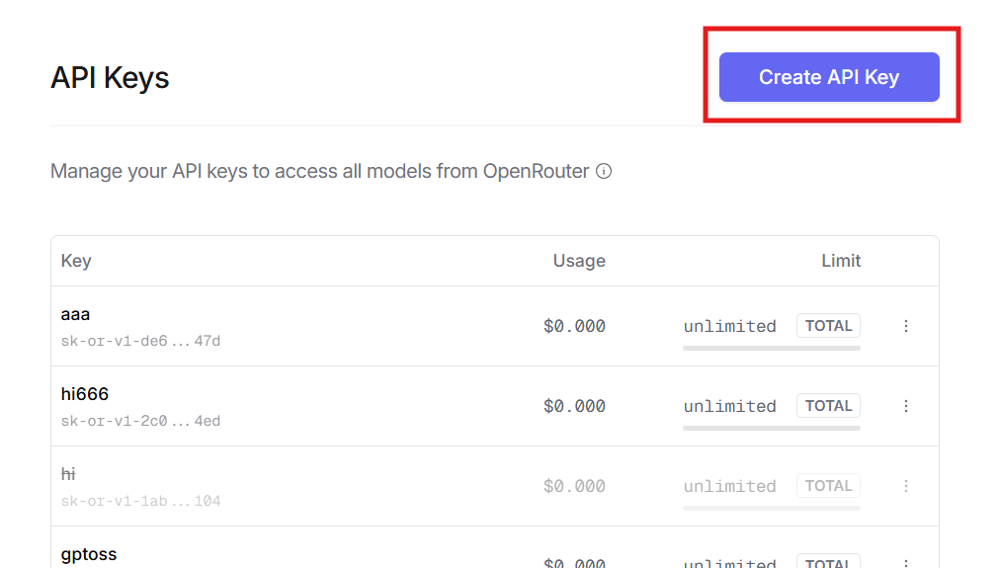
- **Step 3 按下 Create 並記下自己的API KEY**

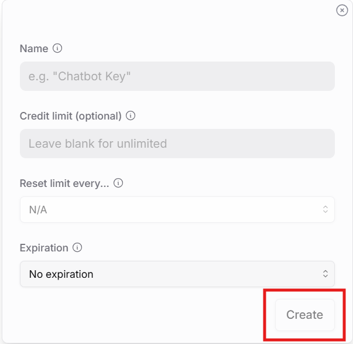

### 2. ChatBox 下載

- **官網在這**：[點擊前往下載](https://chatboxai.app/zh-TW)

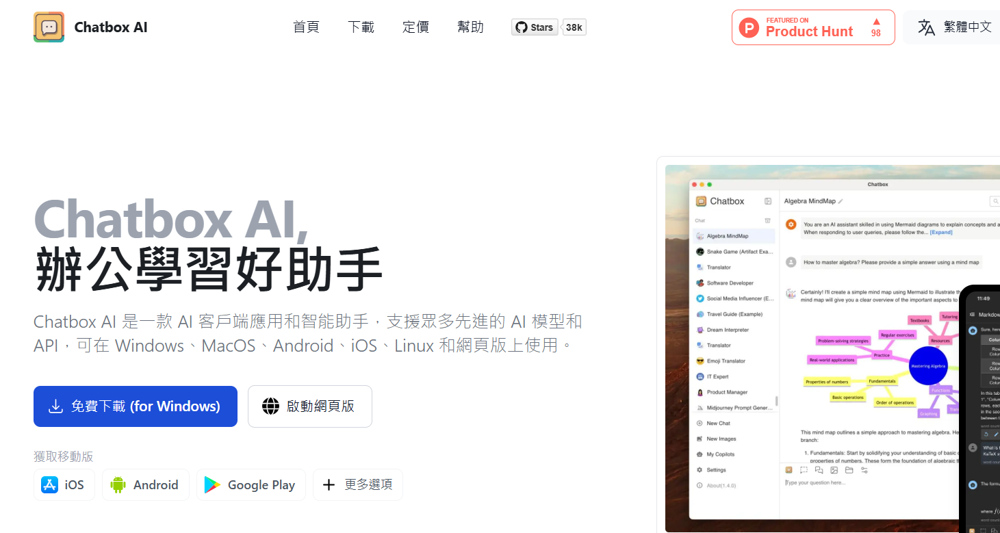

- **1. 下載並安裝完後開啟應用的設定**
  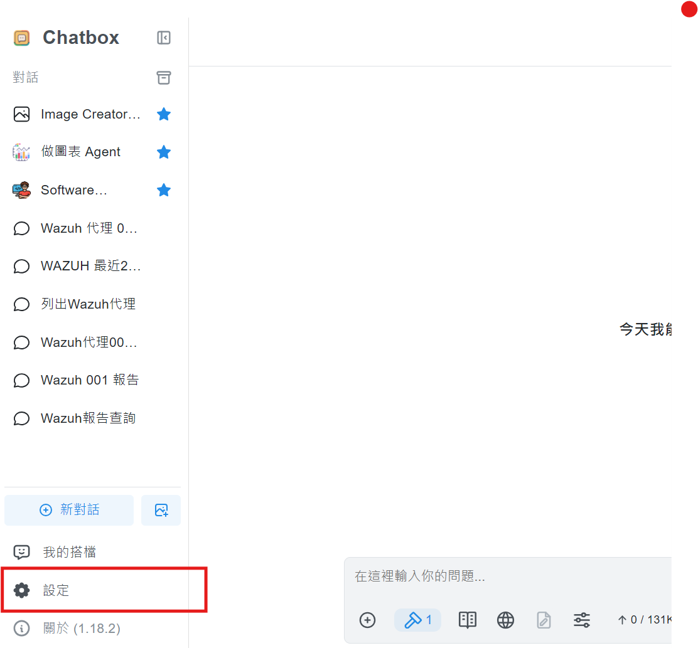
- **2. 選擇 OpenRouter 並填上自己的 API Key**

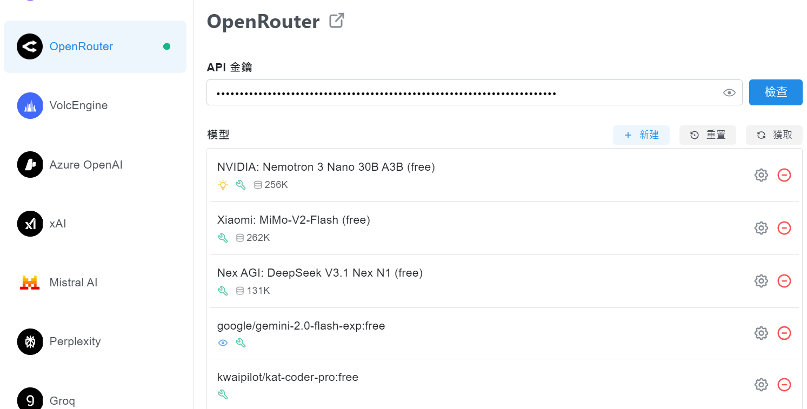

- **3. 按下獲取**

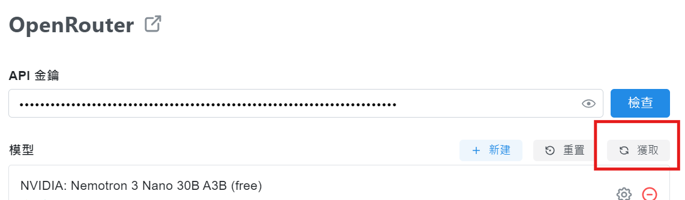

- **4. 輸入 「free 」搜尋，添加模型即可成功開始對話**
- **⚠️ 這是第四個坑要小心，模型要選擇帶有 「綠色🔧」 ，否則無法使用 Wazuh MCP (Gemma系列模型全都沒有工具使用的能力！！)**
  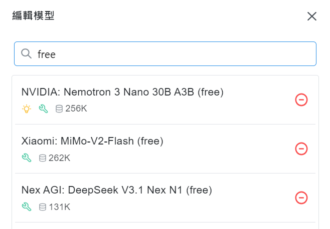

---

## 👍 配置 Wazuh MCP

### 1. 在 chatbox 中選擇 MCP

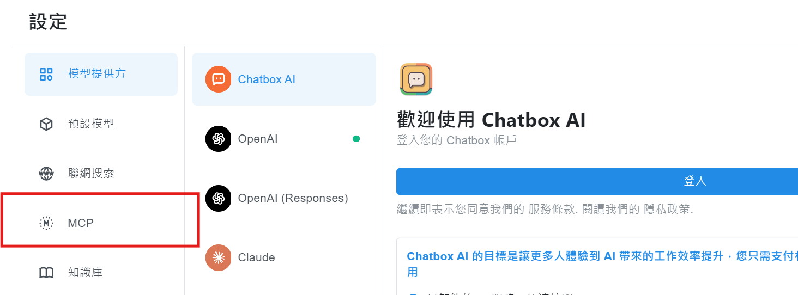

### 2. 複製以下格式內容

- **⚠️ 要先改成自己的API、Indexer、IP、command路徑**

```
{
  "mcpServers": {
    "wazuh": {
      "command": "C:\\ThreatHuntingFinalProject\\target\\release\\mcp-server-wazuh.exe",
      "args": [],
      "env": {
        "WAZUH_API_HOST": "192.168.XX.XX",
        "WAZUH_API_PORT": "55000",
        "WAZUH_API_USERNAME": "wazuh",
        "WAZUH_API_PASSWORD": "XXXXXXXXXXXXXXXX",
        "WAZUH_INDEXER_HOST": "192.168.XX.XX",
        "WAZUH_INDEXER_PORT": "9200",
        "WAZUH_INDEXER_USERNAME": "admin",
        "WAZUH_INDEXER_PASSWORD": "XXXXXXXXXXXXXXXX",
        "WAZUH_TEST_PROTOCOL": "https",
        "WAZUH_VERIFY_SSL": "false",
        "RUST_LOG": "debug"
      }
    }
  }
}
```

### 3. 在 CHATBOX 中選擇自訂MCP

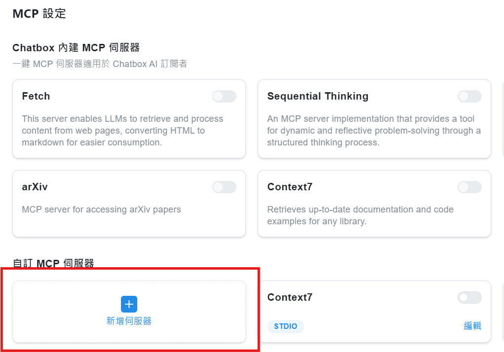

### 4. 貼上第 2 步驟改好的JSON格式

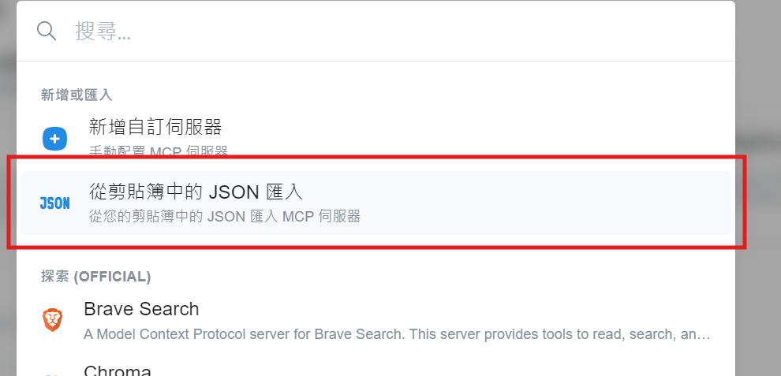

### 5. 即可看到 Wazuh MCP 被成功配置 ✅

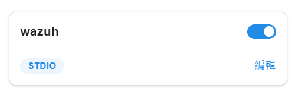

---

## 💬 開始與 AI 對話

### 1. 點選工具將 Wazuh 開啟

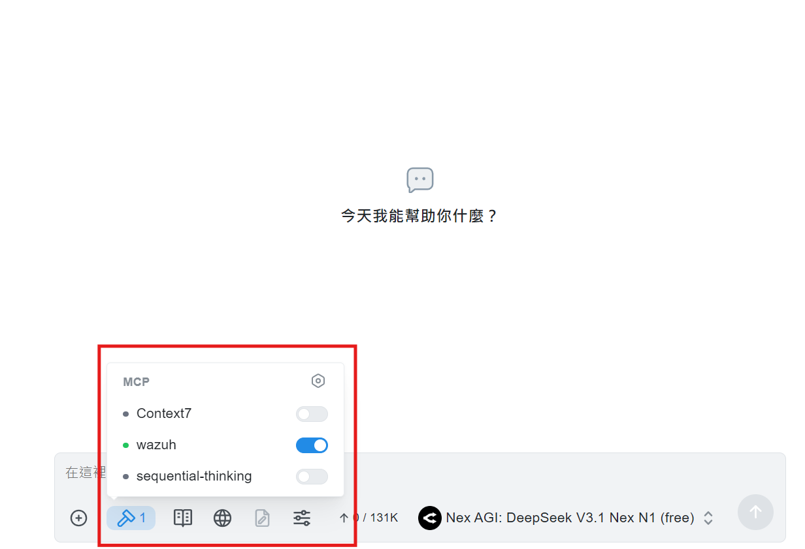

### 2. 選擇有調用工具能力的模型

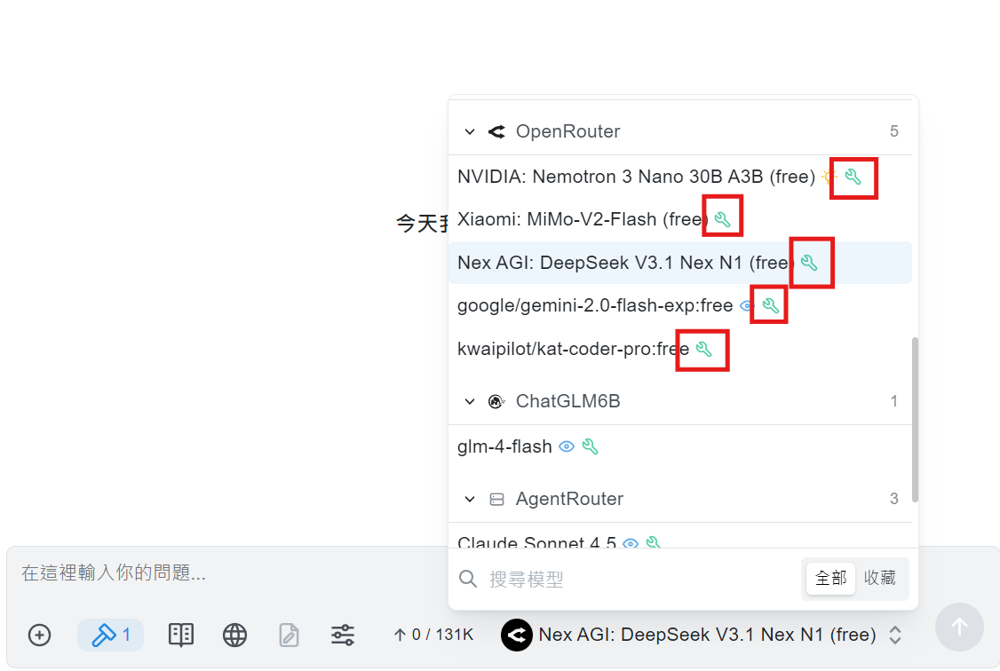

### 3. 開始對話詢問✅

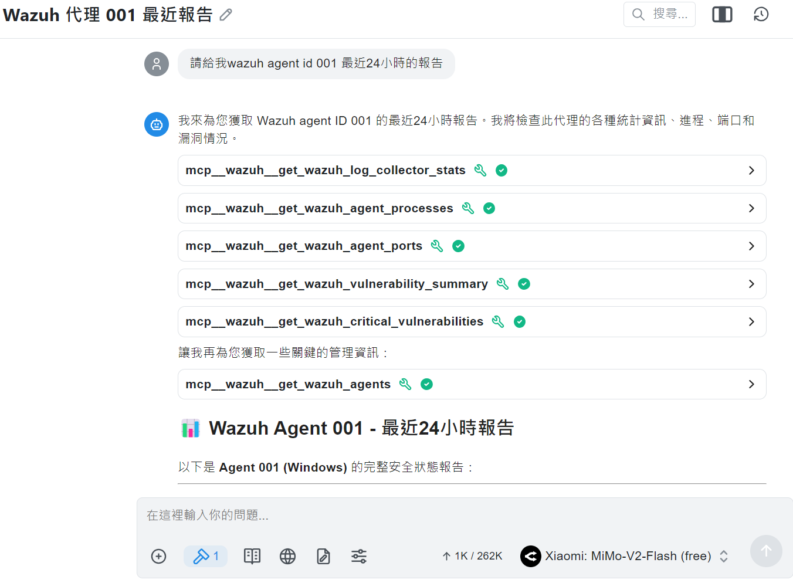

---

# END 🎉